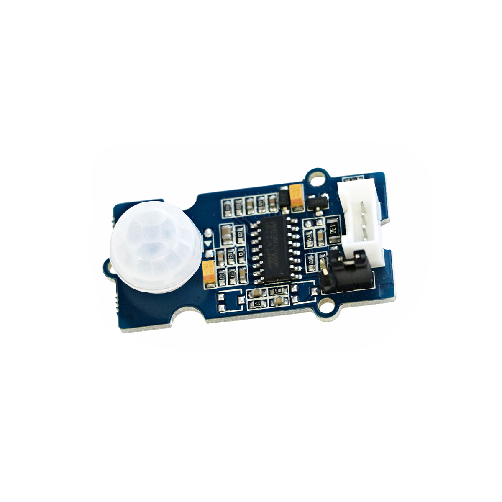

# Bewegungsmelder

## Beschreibung
Der Bewegungsmelder erkennt in seiner näheren Umgebung sich bewegende Objekte. Der Messbereich liegt zwischen 10cm und 6m. Der Sensor gibt solange ein digitales Signal aus, wie eine Bewegung in der Umgebung wahrgenommen wird.

Der Sensor kann direkt oder mithilfe des Grove Shields an einen Arduino oder Raspberry Pi angeschlossen werden. Der Sensor kommuniziert über einen digitalen Pin.

Eine häufige Anwendung ist die Erkennung von sich nähernden Menschen oder Tieren. Mit dem Bewegungsmelder können Leuchten angesteuertoder eine allgemeine Kamerafalle aktiviert werden.

Alle weiteren Hintergrundinformationen sowie ein Beispielaufbau und alle notwendigen Programmbibliotheken sind auf dem offiziellen Wiki (bisher nur in englischer Sprache) von Seeed Studio zusammengefasst. Zusätzlich findet man über alle gängigen Suchmaschinen durch die Eingabe der genauen Komponentenbezeichnung entsprechende Projektbeispiele und Tutorials.

## Beispiele

!!!show-examples:./examples/

<!-- infolist -->

## Wichtige Links für die ersten Schritte:

- [Seeed Studio Wiki](http://wiki.seeedstudio.com/Grove-PIR_Motion_Sensor/) [- Bewegungsmelder](http://wiki.seeedstudio.com/Grove-PIR_Motion_Sensor/)

## Projektbeispiele:

- [Instructables - Vogel-Futterstation](https://www.instructables.com/id/Passive-IR-to-IR-Canon-Trigger/)

## Weiterführende Hintergrundinformationen:

- [GPIO - Wikipedia Artikel](https://de.wikipedia.org/wiki/Allzweckeingabe/-ausgabe)
- [GitHub-Repository: Bewegungsmelder](https://github.com/MakeYourSchool/19-Bewegungsmelder)

